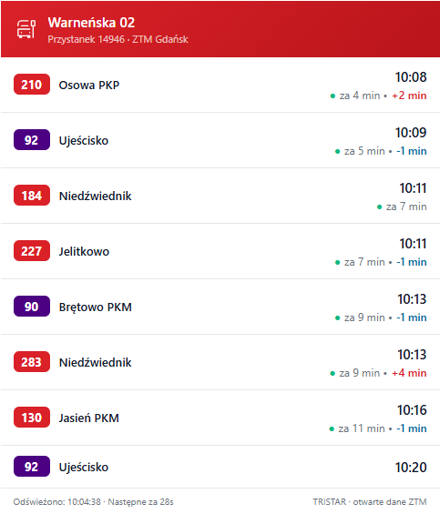
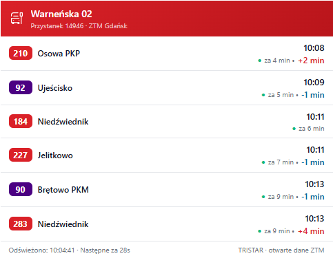
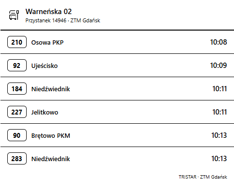
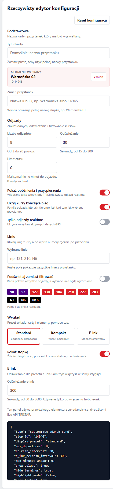

# ZTM Gdańsk Timetable Card

[](https://hacs.xyz)
[](https://github.com/toczke/ztm-gdansk-card/releases)
[](LICENSE)

Lovelace card for Home Assistant showing real-time bus and tram departures for any stop in Gdańsk, powered by the open **TRISTAR** API from ZTM Gdańsk / Otwarty Gdańsk.

**No API key required.** Data is fully open and free under the CC-BY licence.

---

## Features

- 🚌 Real-time departures for any ZTM Gdańsk stop (bus, tram, night lines)
- 🟢 Live indicator — green dot and "za X min" countdown shown only when TRISTAR has real-time GPS data; scheduled-only and e-ink departures show just the clock time
- 🎨 Colour-coded route badges — red for buses, blue for trams, black for night lines
- ⚠️ Delay and early arrival indicators (when TRISTAR reports deviation > 1 min)
- 🔍 Filter by specific lines — route chips are loaded from the static timetable, with live departures as fallback
- 🧾 Full stop pole names in the editor and card title, e.g. `Warneńska 01`
- ⚫ E-ink mode — monochrome card, no animated skeleton/countdown, static footer, and slower refresh
- 🚫 Automatically hides terminal arrivals — stops showing buses that are finishing their run at this stop
- ✏️ Visual editor with stop search and route chips for easy configuration
- ⏱️ Auto-refresh with configurable interval and live countdown to next refresh in the standard theme
- 💀 Skeleton loading state on first load
- 🚫 No page flicker on refresh — only the departure list is updated, not the whole card
- Compact mode for dense dashboards
- Optional footer, max-time window, and real-time-only filtering
- Last-known-good departures are kept on transient API errors
- Editor caches the stop list and static route index locally for faster reopening

---

## Screenshots

### Standard



### Compact



### E-ink



### Visual Editor



---

## Installation

### Via HACS (recommended)

1. Open **HACS** in Home Assistant.
2. Go to **Frontend** → click the three-dot menu → **Custom repositories**.
3. Add `https://github.com/toczke/ztm-gdansk-card` with category **Dashboard**.
4. Find **ZTM Gdańsk Timetable Card** and click **Download**.
5. Hard reload your browser: **Ctrl+Shift+R** (Cmd+Shift+R on Mac).

### Manual

1. Download `ztm-gdansk-card.js` from the [latest release](https://github.com/toczke/ztm-gdansk-card/releases/latest).
2. Copy it to `config/www/ztm-gdansk-card.js`.
3. Go to **Settings → Dashboards → Resources → Add resource**:
   - URL: `/local/ztm-gdansk-card.js`
   - Type: `JavaScript module`
4. Hard reload your browser.

---

## Finding your Stop ID

Every physical bus/tram pole in the Tri-City has a unique **stopId** in the TRISTAR system.

**Option A – ZTM map**
Go to [mapa.ztm.gda.pl](https://mapa.ztm.gda.pl), click a stop, and read the ID from the info panel.

**Option B – przyjazdy.pl**
Browse to [przyjazdy.pl](https://przyjazdy.pl), select a stop — the number at the end of the URL is the stopId.

**Option C – TRISTAR stops API**
The full stops list is available at:
```
https://ckan.multimediagdansk.pl/dataset/c24aa637-3619-4dc2-a171-a23eec8f2172/resource/4c4025f0-01bf-41f7-a39f-d156d201b82b/download/stops.json
```
Each stop object has `stopId` and `stopDesc` (name).

---

## Configuration

### Minimal

```yaml
type: custom:ztm-gdansk-card
stop_id: "1327"
```

### Full example

```yaml
type: custom:ztm-gdansk-card
stop_id: "1327"
title: Autobusy spod domu
display_preset: standard
max_departures: 10
refresh_interval: 30
show_delays: true
hide_terminus: true
highlight_mode: false
e_ink_refresh_interval: 300
max_minutes_ahead: 0
show_footer: true
realtime_only: false
filter_routes:
  - "110"
  - "148"
  - "N8"
```

### Options

| Option | Type | Default | Description |
|---|---|---|---|
| `stop_id` | string | **required** | TRISTAR stop ID |
| `title` | string | stop name from API | Custom card title |
| `display_preset` | string | `standard` | Card layout: `standard`, `compact`, or `e_ink` |
| `max_departures` | number | `10` | Number of departures shown (3–20) |
| `refresh_interval` | number | `30` | Auto-refresh in seconds (15–300) |
| `e_ink_refresh_interval` | number | `300` | Auto-refresh in seconds when `display_preset: e_ink` is enabled (60–3600) |
| `max_minutes_ahead` | number | `0` | Hide departures later than this many minutes ahead. `0` disables the limit |
| `show_delays` | boolean | `true` | Show delay/early arrival badges |
| `hide_terminus` | boolean | `true` | Hide buses finishing their run at this stop |
| `highlight_mode` | boolean | `false` | When using `filter_routes`: dim other lines instead of hiding them |
| `show_footer` | boolean | `true` | Show or hide the footer |
| `realtime_only` | boolean | `false` | Show only departures with `status: REALTIME` |
| `filter_routes` | list | _(all lines)_ | Only show (or highlight) these route IDs |

`compact_mode`, `e_ink_mode`, and `hide_scheduled` are still accepted for older YAML configs. New configs should use `display_preset` and `realtime_only`.

---

## How the time column works

The card uses the `status` field from the TRISTAR API to determine whether a departure has live GPS data:

| Status | What you see |
|---|---|
| `REALTIME` | 🟢 dot + **za X min** + clock time below |
| `SCHEDULED` | Clock time only (no countdown, no dot) |

This mirrors the behaviour of the official TRISTAR departure boards.

Delay badges appear only for real-time departures and only when the deviation is ≥ 1 minute. Positive values mean late, negative values mean early.

---

## Route Chips

The visual editor loads route chips from the static ZTM timetable (`stopsintrip.json` + `routes.json`), so it can show all lines assigned to the selected stop. If the static timetable cannot be loaded, the editor falls back to the live `departures` endpoint; in that case the chip list can be incomplete because it only contains currently upcoming departures.

---

## Data freshness

If a refresh fails after the card already has valid data, the card keeps showing the last successful departures and displays a small warning. This avoids replacing a working board with an empty error state during short API or network interruptions.

The editor also stores the stop list and route index in browser `localStorage` for 24 hours. Live departures are not cached.

---

## E-ink Mode

When `display_preset: e_ink` is enabled, the card uses a monochrome high-contrast layout, removes animated loading shimmer, hides the live minute countdown and dynamic "refreshed / next refresh" footer text, stops the 1-second countdown timer, and uses `e_ink_refresh_interval` instead of `refresh_interval`.

---

## Recommended configs

Standard dashboard:

```yaml
type: custom:ztm-gdansk-card
stop_id: "14945"
display_preset: standard
max_departures: 8
```

Compact mobile card:

```yaml
type: custom:ztm-gdansk-card
stop_id: "14946"
display_preset: compact
max_departures: 6
```

E-ink screen:

```yaml
type: custom:ztm-gdansk-card
stop_id: "14945"
display_preset: e_ink
e_ink_refresh_interval: 300
show_footer: true
```

---

## Local development

The repository includes a small local harness that runs the real editor and preview card without Home Assistant:

```bash
node dev/server.cjs 8123
```

Then open `http://127.0.0.1:8123/dev/`. The harness uses the live TRISTAR API and does not mock departures.

---

## Multiple stops in a grid

```yaml
type: grid
columns: 2
square: false
cards:
  - type: custom:ztm-gdansk-card
    stop_id: "1327"
    title: Kierunek centrum
    max_departures: 6

  - type: custom:ztm-gdansk-card
    stop_id: "1328"
    title: Kierunek powrotny
    max_departures: 6
```

---

## Data source & licence

Departure data comes from the **TRISTAR** system operated by ZTM Gdańsk, published as open data on [Otwarty Gdańsk](https://ckan.multimediagdansk.pl/dataset/tristar) under the **Creative Commons Attribution (CC-BY)** licence.

- Departures endpoint: `https://ckan2.multimediagdansk.pl/departures?stopId={id}`
- Stops list: `https://ckan.multimediagdansk.pl/dataset/tristar`

The API requires no authentication. Data is updated in real-time from GPS devices installed on all ZTM vehicles. Departures without GPS lock fall back to the scheduled timetable (`status: SCHEDULED`).

---

## Troubleshooting

| Symptom | Likely cause | Fix |
|---|---|---|
| `Custom element doesn't exist` | JS not registered | Check **Settings → Dashboards → Resources** for the JS entry; hard reload |
| Card not in `www/community/` | HACS didn't download | Make sure the repo has a published GitHub Release; use HACS → Redownload |
| "Błąd pobierania danych" | Wrong `stop_id` or network issue | Verify the ID at przyjazdy.pl; check HA can reach `ckan2.multimediagdansk.pl` |
| "Brak nadchodzących odjazdów" | No departures soon | Normal late at night or for infrequent lines; remove `filter_routes` to check |
| All departures show only clock, no countdown | No real-time GPS data | Normal — TRISTAR only sends live data when the vehicle is tracked |
| Terminal arrivals still showing | Stop name mismatch | Set `hide_terminus: false` and report the stop ID in an issue |

---

## Licence

MIT — do whatever you want, attribution appreciated.
